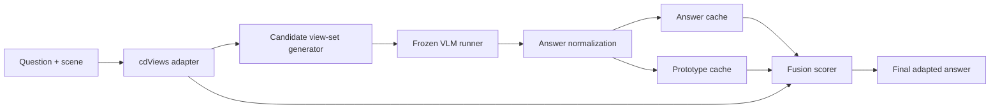

# TTA3DCache

TTA3DCache is a training-free test-time adaptation wrapper for multi-view 3D question answering. It uses cdViews as the host pipeline and adds a question-local answer cache, optional answer prototypes, and deterministic candidate view-set generation without updating model parameters.

The default mode is question-local and resets the cache for every scene-question pair.

## Architecture



## Layout

```text
configs/                  # YAML presets for baseline and ablations
docs/                     # Submodule mapping and implementation report
scripts/                  # CLI entry points
src/tta3dcache/           # New implementation modules
src/tta3dcache/cdViews/   # Upstream host pipeline fork
src/tta3dcache/TDA/       # Upstream cache reference fork
src/tta3dcache/Uni-Adapter/ # Upstream prototype reference fork
tests/                    # CPU-only unit tests and smoke test
```

## Setup

```bash
git submodule update --init --recursive
python -m venv .venv
source .venv/bin/activate
pip install -e .
```

If you are working on the AllianceCan environment, load the required modules before creating a virtual environment, as described in [.github/copilot-instructions.md](.github/copilot-instructions.md).

## Baseline And MVP

Run the baseline wrapper:

```bash
python scripts/run_cdviews_baseline.py --config configs/baseline.yaml
```

Run the TTA3DCache MVP:

```bash
python scripts/run_tta3dcache.py --config configs/full_tta3dcache.yaml
```

## Ablations

```bash
python scripts/run_tta3dcache.py --config configs/majority_vote.yaml
python scripts/run_tta3dcache.py --config configs/answer_cache.yaml
python scripts/run_tta3dcache.py --config configs/prototype_cache.yaml
```

## Evaluation

Compare two JSONL prediction files:

```bash
python scripts/evaluate_predictions.py \
	--predictions outputs/full_tta3dcache/predictions.jsonl \
	--compare outputs/baseline/predictions.jsonl
```

Inspect a run:

```bash
python scripts/inspect_run.py \
	--predictions outputs/full_tta3dcache/predictions.jsonl \
	--limit 20
```

## Output Format

Each JSONL row includes the run id, scene and question ids, the base answer, the final answer, the generated candidate view sets, the raw candidate answers, and the VLM call count.

## Failure Modes

- Missing external cdViews dependencies: use the mock adapter path in tests or wire a real adapter later.
- Malformed model responses: the pipeline falls back to normalized raw text.
- Overly uncertain caches: the fusion scorer can revert to the base cdViews answer.

## Adding A Dataset Or VLM

Implement a `CdViewsAdapter` that returns a `PreparedExample`, then provide a `VLMRunner` that can score candidate view sets for that dataset. The rest of the pipeline stays unchanged.

## Limitations

- The shipped smoke path is CPU-only and uses mock adapters.
- The default configuration is question-local and does not persist a cache across questions from the same scene.
- The package preserves the upstream submodules for reference, but the new implementation is intentionally separate.

